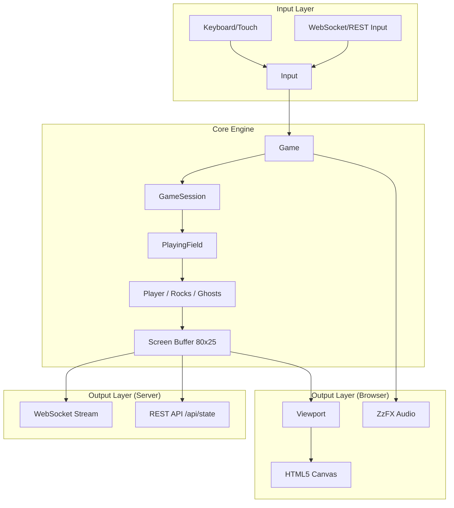

# LadderJS Architecture

This document describes the architecture of **LadderJS**, a modern JavaScript recreation of the 1982 CP/M game *Ladder*.

## Overview

LadderJS is designed with a **Headless-First** approach. The core game logic is entirely decoupled from the rendering environment, allowing it to run identically in a web browser (with Canvas/WebAudio) or in a Node.js server (headless).

## Core Components

### 1. Game Logic Engine
The engine is built around a fixed-grid coordinate system (80x25 characters), mimicking the original terminal-based display of the Kaypro II.

-   **`Game` (Singleton)**: The top-level controller. It manages the main loop, handles state transitions between the Main Menu, Instructions, and active Game Sessions.
-   **`GameSession`**: Manages state that persists across multiple levels, such as lives, total score, and the current level number.
-   **`PlayingField`**: Manages the state of a single active level. This includes the layout (floors, ladders), entity positions (Player, Rocks, Ghosts), and level-specific timers.
-   **`Entity`**: The base class for all moving objects. It handles "Pac-Man style" movement where a direction input is queued until it can be executed.
-   **`Level`**: A data-driven utility that loads level layouts from `levels.json`. It parses the ASCII-based maps into a 2D array and identifies key entity spawn points (Player, Dispensers).

### 2. Level Data Format
The game's levels are defined in `src/levels/levels.json` as an array of objects. This allows for easy level creation and modification without changing game logic.

-   **Level Object Structure**:
    -   `name`: The display name of the level.
    -   `layout`: An array of 20 strings, each 80 characters long, representing the 80x25 grid (some rows are reserved for UI).
    -   `time` (optional): Starting bonus time for the level.
    -   `maxRocks` (optional): Override for the maximum number of concurrent rocks.

-   **Map Symbols**:
    | Symbol | Meaning | Interaction |
    | :--- | :--- | :--- |
    | `p` | Player Start | Initial position of "The Lad". Replaced with space after loading. |
    | `=` | Floor | Solid ground for players and rocks. |
    | `-` | Disappearing Floor | Crumbles and disappears after the player walks over it. |
    | `H` | Ladder | Allows vertical movement. |
    | `|` | Wall | Blocks horizontal movement. |
    | `$` | Treasure | The level goal. Collecting this triggers the win state. |
    | `&` | Statue | Bonus point pickup. |
    | `K` | Key | Opens all doors (`#`) on the level. |
    | `#` | Door | Solid wall until a Key is collected. |
    | `V` | Rock Dispenser | Periodically spawns Rocks. |
    | `G` | Ghost Dispenser | Periodically spawns Ghosts. |
    | `^` | Fire | Deadly to the player. |
    | `.` | Trampoline | Randomly bounces the player in a new direction. |
    | `*` | Eater / Boundary | Often used at level edges or as aesthetic markers. |

### 3. The "Screen" Abstraction
Instead of drawing directly to a Canvas, the game logic writes to a `Screen` object—an 80x25 grid of characters.
-   In the **Browser**, the `Viewport` reads this grid and renders it to an HTML5 Canvas using a custom spritesheet font.
-   On the **Server**, the grid is serialized and broadcast to remote clients via WebSockets.

## Cross-Platform Architecture

The project uses a "Shim" pattern to support both Browser and Node.js environments from a single codebase.

| Feature | Browser Implementation | Server (Node.js) Shim |
| :--- | :--- | :--- |
| **Rendering** | HTML5 Canvas (`Viewport.js`) | No-op / Serializer (`ServerViewport.js`) |
| **Audio** | WebAudio / ZzFX (`Audio.js`) | No-op (`ServerAudio.js`) |
| **Input** | Keyboard/Touch Events (`Input.js`) | WebSocket/REST Injection |
| **Sprites** | Image loading (`Sprite.js`) | Metadata only (`ServerSprite.js`) |

The `gulpfile.js` uses Rollup aliases to swap these modules during the server build process.

## Data Flow Diagram

## Build & Asset Pipeline

-   **Gulp & Rollup**: Used for bundling. Rollup handles the module aliasing for the server build.
-   **Aseprite CLI**: Automated tool that takes `.aseprite` source files, packs them into a single `sprites.png`, and generates a `SpriteSheet-gen.js` with UV coordinates.
-   **ZzFX**: A tiny sound effect generator used to produce authentic 8-bit sounds without large audio files.

## Server-Side Hosting

The `ServerGame` class monkey-patches the `Game` singleton to run at a fixed 60 FPS in Node.js. It provides:
-   **WebSocket Server**: Real-time streaming of the screen state.
-   **REST API**: For checking game status or programmatically injecting moves (ideal for AI/Bots).
-   **Remote Play**: A `client.html` is provided that acts as a thin terminal, connecting to a running server instance.
